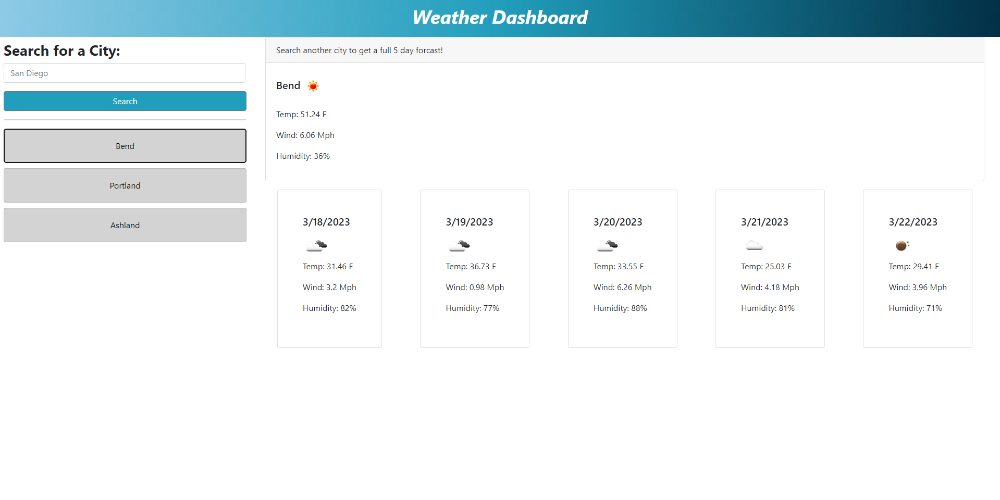

# Weather Dashboard

## Description

This project is designed to create a working web page that offers a place to search a city and retrieve a 5 day weather forecast based on your search. It will show you a variety of information that is able to be stored in local storage and access easily upon return. 

## Insallation

N/A

## Usage

This page will serve any and all users who want to search for a city and get accurate up to date information on its weather conditions.

Below you will find a screenshot to this website.

[Check out its functionality here!](https://volexity21.github.io/Weather-Dashboard/)

[Feel free to join me through past and future projects!](https://github.com/Morralytics)

## Credits

These questions were created and implimented by myself using knowledge from the Bootcamp and a variety of research sites such as W3Schools, Stack overflow, and MDN Webdocs.
